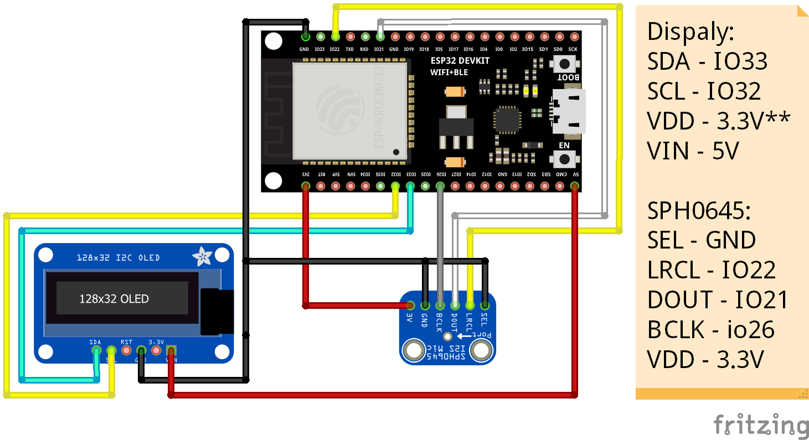

### This Project is inspired from [this](https://github.com/atomic14/voice-controlled-robot) repository. Majority of the code is used from this repo.
# VoiceDetectionESP32
***
For circuit design I have used these components:

    1. I2S OLED Display
    2. SPH0645 (I2S) MEMS microphone
    3. 1000uF capacitor

## ESP32 
ESP32 firmware built using Platform.io. This runs the neural network trying to detect this set of words.

    zero, one, two, three, four, five, six, seven, eight, nine, tree, bird, cat, dog, happy, house and wow.

The code takes audio input through SPH0645 Microphone and tries to detect detect if the word is in the list then prints the detected word with a percentage of how much sure it is about detected word.

## Machine-Learning

Jupyter notebooks for creating a TensorFlow Lite model for "speech word" recognition.
A pre-trained `converted_model.tflite` model and a compressed `model.cc` has been generated and also added to the ESP32 firmware folder.

For trainning dataset [this](http://download.tensorflow.org/data/speech_commands_v0.01.tar.gz) dataset is used. (`16KH mono`)

## TEST 
<html>
<iframe width="1051" height="591" src="https://www.youtube.com/embed/F7vG49up-y4" title="YouTube video player" frameborder="0" allow="accelerometer; autoplay; clipboard-write; encrypted-media; gyroscope; picture-in-picture" allowfullscreen></iframe>
</html>